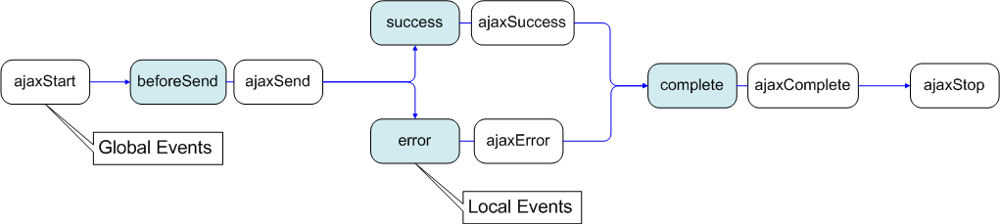

**REST** (Representational state transfer) – это стиль архитектуры программного обеспечения для распределенных систем.

В общем случае REST является очень простым интерфейсом управления информацией без использования каких-то дополнительных внутренних прослоек. Каждая единица информации однозначно определяется глобальным идентификатором, таким как URL. Каждая URL в свою очередь имеет строго заданный формат

Каждая единица информации однозначно определяется URL – это значит, что URL по сути является первичным ключом для единицы данных. Т.е. например третья книга с книжной полки будет иметь вид /book/3, а 35 страница в этой книге — /book/3/page/35.

**GET /book/** — получить список всех книг
**GET /book/3/** — получить книгу номер 3
**PUT /book/** — добавить книгу (данные в теле запроса)
**POST /book/3** – изменить книгу (данные в теле запроса)
**DELETE /book/3** – удалить книгу

### Вообще, POST может использоваться одновременно для всех действий изменения: 
POST /book/ – добавить книгу (данные в теле запроса)
POST /book/3 – изменить книгу (данные в теле запроса)
POST /book/3 – удалить книгу (тело запроса пустое)

Для каждой единицы информации (info) определяется 5 действий. А именно:

**GET /info/ (Index)** – получает список всех объектов. Как правило, это упрощенный список, т.е. содержащий только поля идентификатора и названия объекта, без остальных данных.

**GET /info/{id} (View)** – получает полную информацию о объекте.

**PUT /info/ или POST /info/ (Create) – создает новый объект. Данные передаются в теле запроса без применения кодирования, даже urlencode.

**POST /info/{id} или PUT /info/{id} (Edit)** – изменяет данные с идентификатором {id}, возможно заменяет их. Данные так же передаются в теле запроса, но в отличие от PUT здесь есть некоторый нюанс. Дело в том, что POST-запрос подразумевает наличие urldecoded-post-data. Т.е. если не применять кодирования – это нарушение стандарта. Тут кто как хочет – некоторые не обращают внимания на стандарт, некоторые используют какую-нибудь post-переменную.

**DELETE /info/{id} (Delete)** – удаляет данные с идентификатором {id}.

### Какие можно сделать из этого выводы:

Как видно, в архитектура REST очень проста в плане использования. По виду пришедшего запроса сразу можно определить, что он делает, не разбираясь в форматах (в отличие от SOAP, XML-RPC). Данные передаются без применения дополнительных слоев, поэтому REST считается менее ресурсоемким, поскольку не надо парсить запрос чтоб понять что он должен сделать и не надо переводить данные из одного формата в другой. 

---

### method (значение по умолчанию: 'GET')
Тип: String
параметер (например "POST", "GET", "PUT" и т.д.).

## jQuery(..).load
Загрузка HTML кода в необходимый нам DOM элемент на странице.
```js
// по окончанию загрузки страницы
$(document).ready(function(){              
    // вешаем на клик по элементу с id = example-1
    $('#example-1').click(function(){
        // загрузку HTML кода из файла example.html
        $(this).load('ajax/example.html');       
    }) 
}); 
```
## jQuery.ajax
 У данного метода лишь один входной параметр — объект включающий в себя все настройки :
* ``async`` — асинхронность запроса, по умолчанию true
* ``cache`` — вкл/выкл кэширование данных браузером, по умолчанию true
* ``contentType`` — по умолчанию «application/x-www-form-urlencoded»
* ``data`` — передаваемые данные — строка иль объект
* ``dataFilter`` — фильтр для входных данных
* ``dataType`` — тип данных возвращаемых в callback функцию (xml, html, script, json, text, _default)
* ``global`` — тригер — отвечает за использование глобальных AJAX Event'ов, по умолчанию true
* ``ifModified`` — тригер — проверяет были ли изменения в ответе сервера, дабы не слать еще запрос, по умолчанию false
* ``sonp`` — переустановить имя callback функции для работы с JSONP (по умолчанию генерируется на лету)
* ``processData`` — по умолчанию отправляемые данный заворачиваются в объект, и отправляются как «application/x-www-form-urlencoded», если надо иначе — отключаем
* ``scriptCharset`` — кодировочка — актуально для JSONP и подгрузки JavaScript'ов
* ``timeout`` — время таймаут в миллисекундах
* ``type`` — GET либо POST
* ``url`` — url запрашиваемой страницы

### Локальные AJAX Event'ы:
* ``beforeSend`` — срабатывает перед отправкой запроса
* ``error`` — если произошла ошибка
* ``success`` — если ошибок не возникло
* ``complete`` — срабатывает по окончанию запроса

### Для организации HTTP авторизации (О_о):
* username — логин
* password — пароль
```js
$.ajax({
    url: '/ajax/example.html',             // указываем URL и
    dataType : "json",                     // тип загружаемых данных
    success: function (data, textStatus) { // вешаем свой обработчик на функцию success
        $.each(data, function(i, val) {    // обрабатываем полученные данные
            /* ... */
        });
    } 
});
```
### jQuery.get
Загружает страницу, используя для передачи данных GET запрос. Может принимать следующие параметры:
* url запрашиваемой страницы
передаваемые данные (необязательный параметр)
* callback функция, которой будет скормлен результат (необязательный параметр)
* тип данных возвращаемых в callback функцию (xml, html, script, json, text, _default)

### jQuery.post
Данный метод аналогичен предыдущему, лишь передаваемые данные уйдут на сервер посредством POST'а. Может принимать следующие параметры:
* url запрашиваемой страницы
передаваемые данные (необязательный параметр)
* callback функция, которой будет скормлен результат (необязательный параметр)
* тип данных возвращаемых в callback функцию (xml, html, script, json, text, _default)
```js
$(document).ready(function(){                          // по завершению загрузки страницы
    $('#example-3').click(function(){                  // вешаем на клик по элементу с id = example-3
        $.post('ajax/example.xml', {}, function(xml){  // загрузку XML из файла example.xml   
            $('#example-3').html('');
            $(xml).find('note').each(function(){       // заполняем DOM элемент данными из XML
                $('#example-3').append('To: '   + $(this).find('to').text() + '<br/>')
                               .append('From: ' + $(this).find('from').text() + '<br/>')
                               .append('<b>'    + $(this).find('heading').text() + '</b><br/>')
                               .append(           $(this).find('body').text() + '<br/>');
            });
        }, 'xml');                                     // указываем явно тип данных
    })
});
```
### jQuery.getJSON
Загружает данные в формате JSON (удобней и быстрее нежели XML).
```js
$(document).ready(function(){                            // по завершению загрузки страницы
    $('#example-4').click(function(){                    // вешаем на клик по элементу с id = example-4
        $.getJSON('ajax/example.json', {}, function(json){  // загрузку JSON данных из файла example.json   
            $('#example-4').html('');
                                                         // заполняем DOM элемент данными из JSON объекта
            $('#example-4').append('To: '   + json.note.to + '<br/>')
                           .append('From: ' + json.note.from + '<br/>')
                           .append('<b>'    + json.note.heading + '</b><br/>')
                           .append(           json.note.body + '<br/>');
        });                
    })
});
```
### jQuery.getScript
данная функция загружает и выполняет локальный JavaScript.
```js
$(document).ready(function(){                          // по завершению загрузки страницы
    $('#example-5').click(function(){                  // вешаем на клик по элементу с id = example-5
        $.getScript('ajax/example.js', function(){     // загрузку JavaScript'а из файла example.js 
            testAjax();                                // выполняем загруженный JavaScript
        });                
    })
});
```

### События

Пример для отображения элемента с id=«loading» во время выполнения любого AJAX запроса:
```js
$("#loading").bind("ajaxSend", function(){
    $(this).show(); // показываем элемент
}).bind("ajaxComplete", function(){
    $(this).hide(); // скрываем элемент
});
```
Для локальных событий — вносим изменения в опции метода ajax():
```js
$.ajax({
    beforeSend: function(){
        // Handle the beforeSend event
    },
    complete: function(){
        // Handle the complete event
    }
    // ...
});
```


Ну и собственно список всех event'ов:

* ``ajaxStart`` — Данный метод вызывается в случае когда побежал AJAX запрос, и при этом других запросов нету
* ``beforeSend`` — Срабатывает до отправки запроса, позволяет редактировать XMLHttpRequest. Локальное событие
* ``ajaxSend`` — Срабатывает до отправки запроса, аналогично beforeSend
* ``success`` — Срабатывает по возвращению ответа, когда нет ошибок ни сервера, ни вернувшихся данных. Локальное событие
* ``ajaxSuccess`` — Срабатывает по возвращению ответа, аналогично success
* ``error`` — Срабатывает в случае ошибки. Локальное событие
* ``ajaxError`` — Срабатывает в случае ошибки
* ``complete`` — Срабатывает по завершению текущего AJAX запроса (с ошибкои или без — срабатывает всегда).Локальное событие
* ``ajaxComplete`` — Глобальное событие, аналогичное complete
* ``ajaxStop`` — Данный метод вызывается в случае когда больше нету активных запросов