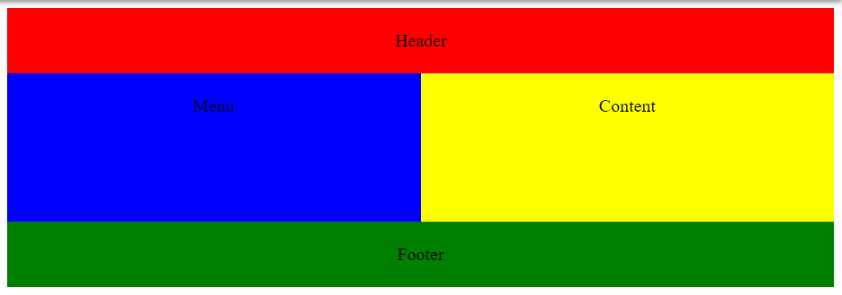
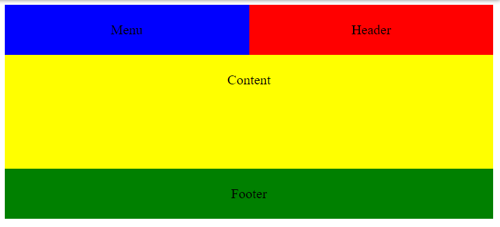

## Grid
 * **display: grid**
 * **display: inline-grid**
 *  grid-template-columns 
    ```css
    grid-template-columns: 1fr 1fr 1fr;
    grid-template-columns: 500px 1fr 2fr;
    grid-template-columns:  repeat(5, 1fr 2fr);
    ```
    ```css
    .wrapper {
        display: grid;
        grid-template-columns: 1fr 1fr 1fr;
    }
    Can also be written as:

    .wrapper {
        display: grid;
        grid-template-columns: repeat(3, 1fr);
    }
    ```
 * grid-template-rows
    ```css
    grid-auto-rows: 200px;
    grid-template-rows: 200px;
    grid-auto-rows: minmax(100px, auto);
    ```

#

* grid-column-start
* grid-column-end
* grid-row-start
* grid-row-end

##  were prefixed with the grid- prefix
* column-gap
* row-gap 
* gap
* grid-column-gap
* grid-row-gap 
* grid-gap 

## z-index
 If we give box2 a lower z-index than box1 it will display below box1 in the stack.

 # 
 The repeat() function takes two arguments, the first will define the number of column tracks and the second, what width the tracks should be.

In this case, for the first argument, I’ve used auto-fill which will create a grid with as many tracks as will fit into the container. The second argument, which defines the width of the tracks, I’ve set to minmax(250px, 1fr).

The minmax function will create track widths that can be a minimum of 250px wide and a maximum of 1fr.
```js
grid-template-columns: repeat(auto-fill, minmax(250px, 1fr));
```
Often when we put images in a responsive grid layout like this we come across the problem of the images stretching out of proportion. Using
```js
object-fit: cover;
```


# 1
```html
<body class="container">
   <header>Header</header>
   <menu>Menu</menu>
   <main>Content</main>
   <footer>Footer</footer>
</body>
```
```css
body {
  text-align: center;
  display: grid;
  grid-template-columns: 1fr 1fr;
  grid-template-rows: 1fr;
}

header {
  background-color: red;
  padding: 20px;
  grid-column: span 2;
}

footer {
  background-color: green;
  padding: 20px;
  grid-column: span 2;
}

menu {
  background-color: blue;
  padding: 20px;
  margin: 0;
}

main {
  background-color: yellow;
  padding: 20px;
  height: 15vh;
}

@media (max-width: 680px) {
  header {
    grid-column: span 1;
  } 
  
  menu {
    grid-row: 1;
    grid-column: span 1;
  }
  
  main {
    grid-column: span 2;
  }
}
```


