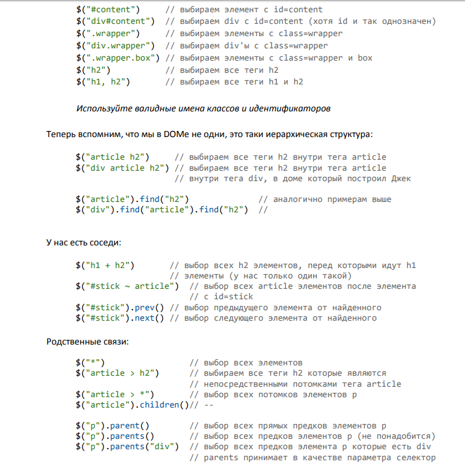

`*` - всім елементам

`$("E.C")`- відповідає всім елементам **E**  з іменем класа **C**.

 `$("E#I")` - всі елементи з **id**.

`$("T")` - всі елементи з назвою теа T.

`$("t,m,o")`- всі елементи  з назвами тегів.

`$("div p")` - шукаємо всі **р** що знаходяться в **div**.

`$("p + div")` - обирає **div** що йде після **p** на тому ж рівні вкладеності(обв'язково один за одним).

`$("p ~ div")` -  обирає **div** що йде після **p** на тому ж рівні вкладеності(НЕобов'язково один за одним).

`$("body > div")` - відбирає елементи **div** котрі є прямими потомками елемента **body**.
```javascript
*$("body > div:has(a)") - відбирає елементи div котрі є прямими потомками  елемента body і містять силки.*
```

`$("E[A]")` - відповілає елементу **E** з артибутом **A**.

 `$("E[A=X]")` - відповідає елементу **Е** з атрибутом **А** котре має значення **X**.

 `$("E[A!=X]")` - відповідає елементу **Е** котрий НЕ має атрибута **А** , або з атрибутом **А** , але котрий НЕ має значення **Х**

 `$("E[A^=V]")` -відповідає елементам **E** з атрибутом **А** котрий починається з **V**.

 `$("E[A*=V]")` -відповідає елементам **E** з атрибутом **А** котрий містить **V**.
  ```javascript
    '$("a[href^=http//]")' - всі силки що почанаються на *http//* за межами нашого сайта.
    '$("a[href*=text.ua]")' - знайде всі чилки де присутнє слово *text.ua*.
  ```

  `$("div:has(ul)")` - обирає всі елементи з іменем тега **div** маючий хочаб один вкладений елемент з іменем **ul**.

 `$("E[A$=V]")` -відповідає елементам **E** з атрибутом **А** котрий закінчується на  **V**.
  ```javascript
   `$("a[href$=.pdf]")` - атрибути що закінчуються а певне значення.
  ```



`:even` - відбирає парні елементи **$("p:even")**.

`:odd` - відбирає непарні елементи.

`:nth-child(odd/event)`**li:nth-child(even)** парні дочерні елементи в кожному списку.**li:nth-child(odd)** непарні елементи в списку.

`:nth-child()` вибирає **n-й** дочерній елемент на сторінці.**li:nth-child(2)** j,обирає 2-ий елемнт в кожному списку.

`eq(index)` - відбирає елементи із масиву по індексу.
`:gt(т)` -оберає елементи розташовані за **n**-им елементом(невраховуючийого).

`:lt(n)`- оберає елемент розташований перед **n**-м елементом(невпраховуючи його).

`:first` - вибір першого співпадіння на сторінці.

`:last` - вибір останнього співпадіння на сторінці.

 `first-child`- перший дочерній елемент контекста.Селектор **li:first-child** обере первий елемент кожного списку.

 `li:last-child` - останній елемент кожного списка

`only-child` - обере всі елементи ,котрі є єдиними дочерніми елементами.

  `:animated` - елементи відтворюючі анімацію.

  `:button`- кнопки.

  `:checkbox`- тільки елементи -флажки **input[type=checkbox]**.

  `:checked`-оберає відмічені флажки і радіокнопки.

  `:contains(foo)`- елементи котрі містять текст**foo**.

  `:disabled`- елементи форм ,Котрі знаходяться в неактивному стані.

  `:enabled`-  елементи форм ,Котрі знаходяться в активному стані.

  `:file`- всі елементи типу file(input[type=file]).

  `:has(selector)`- оберає хоча б один елемент,котрий відповідає селектору.
  ```javascript
  `$("li:has(a)")` - оберає всі теги **li** в котрих присутній тег **а**.
  ```
  `:header`- елементи отрі є заголовками.

  `:hidden`- скриті елементи.

  ```javascript
   $("div:hidden").show() - знайти всі скриті елементи і показати їх.
  ```

  `:image`- зображення **input[type=image]**.

  `:input`- тільки елементи форм(input,select,text-area,button).

  `:not(selector)` - крім певного значення.

  `:parent`- оберає елемент котрий має вложені елементи.

  `:password`- оберає елемент ввода пароля.

  `:radio`- радіокнопку.

  `:reset`-тілкьи кнопки зброса.

  `:selected`-оберає кнопки <otion> котрі були виділені.

  `:submit`- вибриє кнопки відправки форми

  `:text`- елемент ввода тексту.

  `:visible`- тілкьи видимі елементи.

   `:header` - Выбирает только элементы - заголовки HTML

  `:first` - Выбирает первый соответствующий элемент на странице.


  `:first-child` - Селектор :first-child выбирает все только первые дочерние элементы соответствующих родителей.

  `:button` - Выбирает любые элементы-кнопки
  ```html
    <button>,
    <input type=button>,
    <input type=submit>,
    <input type=reset>
   ```

  `$("div:animated")` - оберає відповідний елемент задіяний в анімації на даний момент.
 
 >3-ри квадрати, 2-й постійно анімується.При клікі квадраз що нанімується змінює колір.
 ```html
<button id="run">Run</button>
<div></div>
<div id="mover"></div>
<div></div>
 ```
 ```js
 $( "#run" ).click(function() {
  $( "div:animated" ).toggleClass( "colored" );
  });
 function animateIt() {
  $( "#mover" ).slideToggle( "slow", animateIt );
}
animateIt();
```