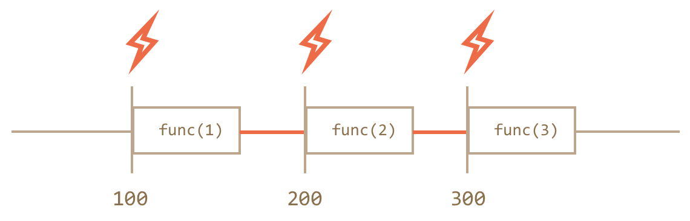
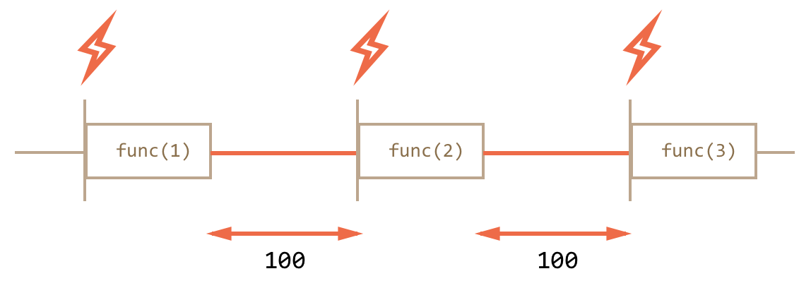

## setTimeout

```js
var timerId = setTimeout(func / code, delay[, arg1, arg2...])
```
* **func/code** - функция для исполнения.
* **delay** - Задержка в миллисекундах, 1000 миллисекунд равны 1 секунде.
* **arg1, arg2…** - Аргументы, которые нужно передать функции. 
```js
function func() {
  alert( 'Привет' );
}

setTimeout(func, 1000);
```
```js
function func(phrase, who) {
  alert( phrase + ', ' + who );
}

setTimeout(func, 1000, "Привет", "Вася"); // Привет, Вася
```
анонимные функции:
```js
 setTimeout(function() { alert('Привет') }, 1000);
 ```
 ## clearTimeout
 ```js
 var timerId = setTimeout(...);
clearTimeout(timerId);
```
```js
var timerId = setTimeout(function() { alert(1) }, 1000);
alert(timerId); // число - идентификатор таймера

clearTimeout(timerId);
alert(timerId); // всё ещё число, оно не обнуляется после отмены
```
## setInterval

Смысл аргументов – тот же самый. Но, в отличие от `setTimeout`, он запускает выполнение функции не один раз, а регулярно повторяет её через указанный интервал времени.

 Остановить исполнение можно вызовом **clearInterval(timerId)**.
 ```js
 // начать повторы с интервалом 2 сек
var timerId = setInterval(function() {
  alert( "тик" );
}, 2000);

// через 5 сек остановить повторы
setTimeout(function() {
  clearInterval(timerId);
  alert( 'стоп' );
}, 5000);
```

## Рекурсивный setTimeout

```js
var timerId = setTimeout(function tick() {
  alert( "тик" );
  timerId = setTimeout(tick, 2000);
}, 2000);
```
Рекурсивный setTimeout – более гибкий метод тайминга, чем setInterval, так как время до следующего выполнения можно запланировать по-разному, в зависимости от результатов текущего.

##  сравним setInterval / setTimeout
### setInterval

В этом случае интерпретатор будет ждать, пока функция завершится, затем проверит таймер и, если время вызова setInterval уже подошло (или прошло), то следующий вызов произойдёт сразу же.

Если функция и выполняется дольше, чем пауза setInterval, то вызовы будут происходить вообще без перерыва.
### setTimeout

При рекурсивном setTimeout задержка всегда фиксирована и равна 100 мс.

Это происходит потому, что каждый новый запуск планируется только после окончания текущего.