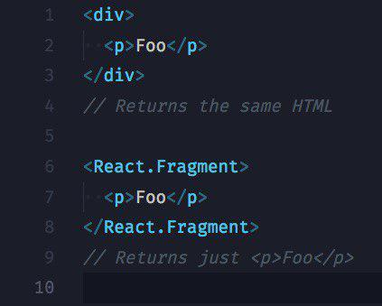

**Object.assign()** используется для копирования значений всех собственных перечисляемых свойств из одного или более исходных объектов в целевой объект. 

```js
var o1 = { a: 1 };
var o2 = { b: 2 };
var o3 = { c: 3 };

var obj = Object.assign(o1, o2, o3);
console.log(obj); // { a: 1, b: 2, c: 3 }
console.log(o1);  // { a: 1, b: 2, c: 3 }, изменился и сам целевой объект.
```
+ {} better
```js
var o1 = { a: 1 };
var o2 = { b: 2 };
var o3 = { c: 3 };

var obj = Object.assign({}, o1, o2, o3);
console.log(obj); // { a: 1, b: 2, c: 3 }
console.log(o1);  //  {a: 1}
```
#
Компоненты созданные с помощью class, называются **statefull** компоненты (то есть, компоненты с состоянием), а компоненты созданные с помощью функции - **stateless** component (то есть, компоненты без состояния). 

Каждый компонент должен возвращать один узел.
 **div** or **<React.Fragment>**

 Bсе что вы возвращаете в render методе или в return у stateless-компонента должно быть обернуто в один тэг / React.Fragment.

 #
In react multiple elements must be wrapped in a parent
But sometimes you need to render children without a parent
This is when you use React.Fragment
It still groups children, but Fragment is likea ghost parent 🙂

 