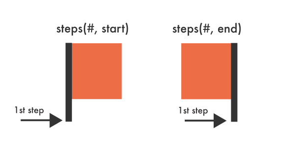

# Plan

- Animation
- Синтаксис transition-timing-function
- Синтаксис animation-iteration-count
- Синтаксис animation-direction
- Use steps()
- transform-origin

## Приклад animation

```css
#box {
  width: 100px;
  height: 100px;
  background-color: red;
  position: relative;
  animation: muv 5s linear 3s infinite alternate;
}

@keyframes muv {
  0% {
    background-color: red;
    left: 0;
    top: 0;
  }
  25% {
    background-color: yellow;
    left: 200px;
    top: 0;
  }
  50% {
    background-color: blue;
    left: 200px;
    top: 200px;
  }
  75% {
    background-color: green;
    left: 0;
    top: 200px;
  }
  100% {
    background-color: red;
    left: 0;
    top: 0;
  }
}
```

```html
<div id="box"></div>
```

Розгорнутий варіант:

```css
animation-name: example;
animation-duration: 5s;
animation-timing-function: linear;
animation-delay: 2s;
animation-iteration-count: infinite;
animation-direction: alternate;
```

---

Короткий варіант:

```css
animation: slidein 3s linear 1s infinite alternate;
```

ім'я анімаціі |тривалість |синхронність(початок і кінець шв.) |затримка |кількість анімацій |наапрямок анімації |

## Синтаксис transition-timing-function

```css
transition-timing-function: ease|ease-in|ease-out|ease-in-out|linear|step-start|step-end|steps|cubic-bezier;
```

transition-timing-function: ease|ease-in|ease-out|ease-in-out|linear|step-start|step-end|steps|cubic-bezier

**Значения**

- `ease`

Анимация начинается медленно, затем ускоряется и к концу движения опять замедляется. Аналогично cubic-bezier(0.25,0.1,0.25,1).

- `ease-in`

Анимация медленно начинается, к концу ускоряется. Аналогично cubic-bezier(0.42,0,1,1).

- `ease-out`

Анимация начинается быстро, к концу замедляется. Аналогично cubic-bezier(0,0,0.58,1).

- `ease-in-out`

Анимация начинается и заканчивается медленно. Аналогично cubic-bezier(0.42,0,0.58,1).

- `linear`

Одинаковая скорость от начала и до конца.

- `step-start`

Как таковой анимации нет. Стилевые свойства сразу же принимают конечное значение.

- `step-end`

Как таковой анимации нет. Стилевые свойства находятся в начальном значении заданное время, затем сразу же принимают конечное значение.

- `steps`

Ступенчатая функция, имеющая заданное число шагов.

```css
transition-timing-function: steps(<число>, start | end);
```

Здесь: <число> — целое число больше нуля; start — задаёт полунепрерывную снизу функцию; end — задаёт полунепрерывную сверху функцию.

- `cubic-bezier`

Задаёт функцию движения в виде кривой Безье.

## Синтаксис animation-iteration-count

CSS свойство animation-iteration-count определяет сколько раз будет проигрываться анимационный цикл, перед тем как остановиться.

- `infinite`

Анимация повторяется бесконечно.

- `<number>`

Сколько раз анимация будет повторяться; по-умолчанию 1. Отрицательные значения не используются. Можно использовать не целые значения, для проигрывания части анимационного цикла (например, 0.5 воспроизведет половину анимационного цикла).

```css
animation-iteration-count: infinite;
animation-iteration-count: 3;
animation-iteration-count: 2.3;

animation-iteration-count: 2, 0, infinite;
```

## Синтаксис animation-direction

CSS свойство animation-direction указывает будет ли анимация проигрываться в реверсе на альтернативных циклах.

Если значение свойства animation-direction установлено как "alternate", анимация будет проигрываться как "normal" каждый нечетный раз (1,3,5 и тд) и как реверс каждый четный раз (2,4,6 и тд).

Если в настройках анимации установлено проигрывание только однажды, это свойство не будет иметь эффекта.

- `normal`

      	После прохождения полного цикла анимация сбрасывается в начальное состояние и начинается заново.

- `reverse`

Анимация воспроизводится в обратном направлении, то есть каждый раз анимация начинает свое воспроизведения со своей конечной точки, проходит весь цикл и начинается заново.

- `alternate`

      	После прохождения полного цикла анимация изменяет свое направление на противоположное. При воспроизведении в обратном направлении все шаги анимации выполняются наоборот.

- `alternate-reverse`

      	Анимация начинает воспроизводится в обратном направлении, потом меняя свое направление на противоположное.

  # Use steps()

  `steps()` is a timing function that allows us to break an animation or transition into segments, rather than one continuous transition from one state to another.

  ```html
  steps(<number_of_steps>, <direction>)</direction></number_of_steps>
  ```

  

```css
.contain-car {
  animation: drive 4s steps(4, end) infinite;
}

.contain-car-2 {
  animation: drive 4s steps(4, end) forwards;
}
```

- infinite (при закінченні повернися назад і позчи ханово)
- forwards (залишися у кінцевому стані)

  > наприклад якщо я міняю колір квадрата в кінці то він і залишиться таким яким став у кінцевому результаті і не зміниться

  _Example_ :
  https://codepen.io/dandelionadia/pen/bGbjNrq

```html
<svg>
  <circle r="50" cx="50%" cy="50%" fill="yellowgreen" />
  <line
    class="second"
    x1="150"
    y1="35"
    x2="148"
    y2="75"
    stroke="violet"
    stroke-width="1.5"
  />
</svg>
```

```css
.second {
  animation: tick-tock 60s steps(60, end) infinite;
  transform-origin: center;
}

@keyframes tick-tock {
  to {
    transform: rotate(360deg);
  }
}
```

## transform-origin

https://developer.mozilla.org/en-US/docs/Web/CSS/transform-origin

> CSS property sets the origin for an element's transformations.

For example, the transformation origin of the rotate() function is the center of rotation
