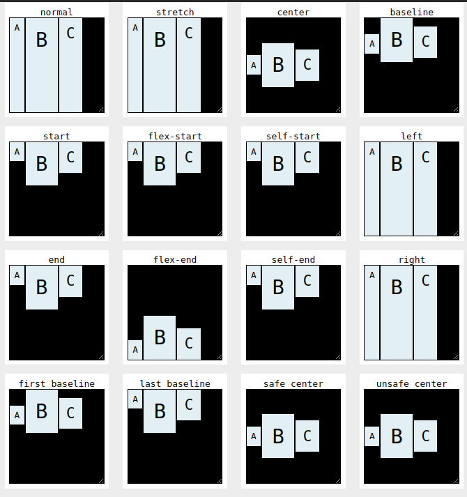

# План:
* селектори
* селектори псевдокласів дял силок
* обтікання елементів
* align-items

## Селектори
* `* {} ` - універсалньий селектор.
* `p,h1 {} ` - селектор по назві тега.
* `.p {} ` - селектор по класу.
* `#text {} ` - селектор по id.
* `.content p {} ` - селектор потомкім ,або контекстний селекто.
  ```html
  <div class="content">
    <p>trxt</p>
  </div>
  ```
* `.content > p {} ` - дочерній селектор. бачить дітей але внуків не баче.
```html
   <div>
    <div>
      <p>trxt</p>  /* небаче внука  */ 
    </div>
    <p>trxt</p> /*баче дітей */
    <p>trxt</p>
  </div>
```
* `a:hover` - селектор псевдокласів
* `:first-child {} ` - силається на перший дочернй елемент батьків.
```
  ## Селектори псевдокласів дял силок

   * `a:link {} ` - підсвічує синім невідвідані силки.

   * `a:visited {} ` - підсвічує фіолетовим вже відвідану силку.

   * `a:hover {} ` - підсвічує блакитним при наведенні на сильку в незалежності відвідана вона чи ні .

   * `a:active {} ` -змінює колір силки на червоний після клацання на неї.

  ## Обтікання

    * `flout` - з якого боку буде вирівняний елемент і з якого боку всі інші елементи будуть його обтікати.


## Розташовує брок горизонтально.
`display: inline-block;`

## Align-items

