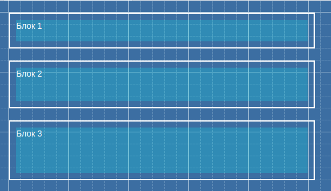
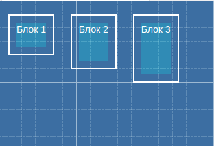
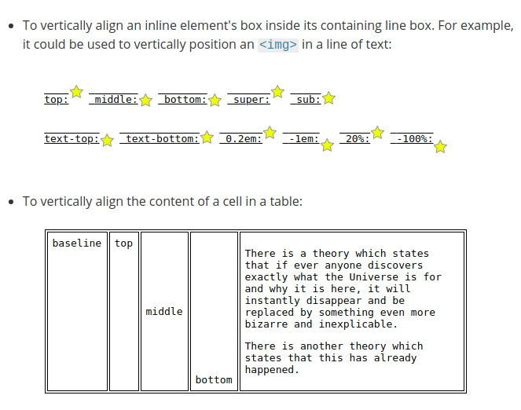

## Display
>Як елемент показаний.
* `display: block;`

* `display: inline-block;`

* `display: inline;`

>Вирівнює елемент вертикалньо відносто батьків,тексту чи оточуючих елементів.

`vertical-align: baseline|bottom|middle|sub|super|text-bottom|text-top|top|inherit | значение | проценты`

