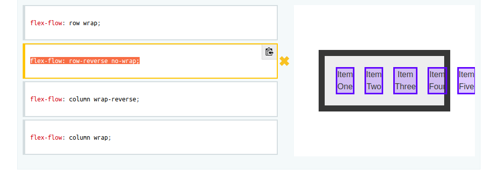
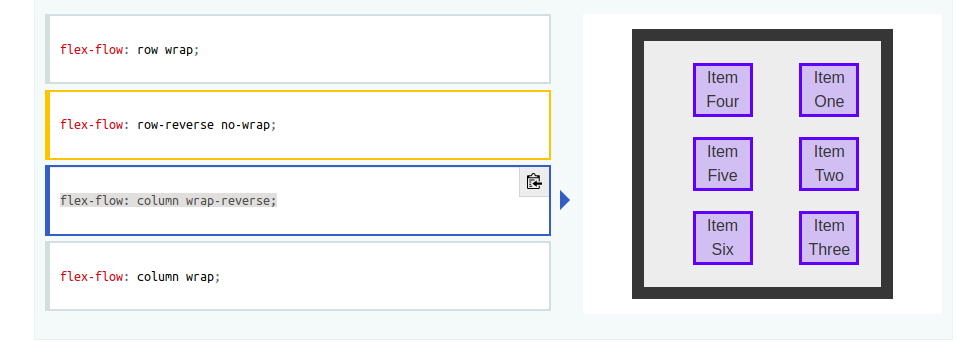
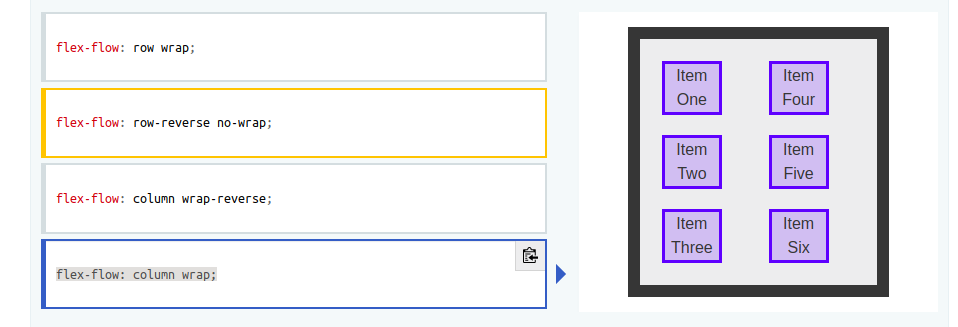
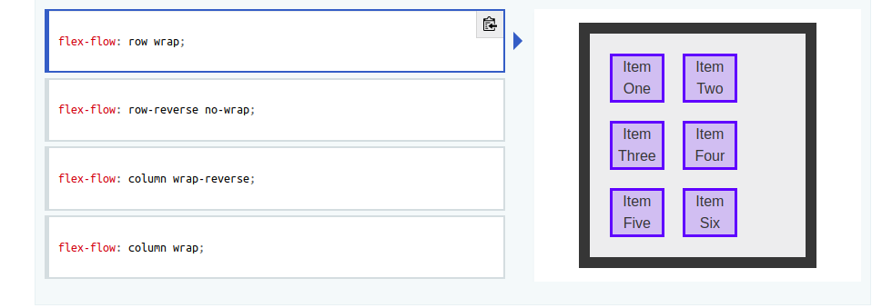

## Flex-boxes
 >Скорочений запис параметрів flex
  ### Flex 
  Виступає скороченням для `flex-grow`, `flex-shrink`, а також `flex-basis` властивостей для встановлення гнучкості `flex-айтема`.

  * `flex-basis` - базовый размер отдельно взятого flex-блока.

  * `flex-grow` - oпределяет то, на сколько отдельный flex-блок может быть больше соседних элементов, если это необходимо.

  * `flex-shrink` - oпределяет, насколько flex-блок будет уменьшаться относительно соседних эдементов внутри flex-контейнера в случае недостатка свободного места. По умолчанию равен 1.

  `flex: none | [ <'flex-grow'> <'flex-shrink'> || <'flex-basis'> ]`

### Align-self 
Выравнивание отдельно взятого flex-блока по поперечной оси.
* `flex-start`: flex-блок прижат к началу поперечной оси
* `flex-end`: flex-блок прижат к концу поперечной оси
* `center`: flex-блок располагаются в центре поперечной оси
* `baseline`: flex-блок выравнен по baseline
* `stretch` (значение по умолчанию) : flex-блок растянут, чтобы занять все доступное место по поперечной оси, при этом учитываются `min-width/max-width`, если таковые заданы.

### Order 
 Визначає порядок розташування **flex** елементів відносно їхнього батьківського **flex** контейнера.Елементи розташовуються у порядку зростання значення **order**. Елементи з однаковим значенням параметра **order** розташовуються в такому порядку, в якому вони розташовані в основному коді.

### Силка
[flex-boxes test](http://html5.by/blog/flexbox/)

## Flex-flow - гнучкий потік

