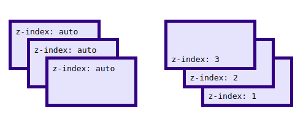

## z-index
>Накладування елементів один на одний.Ця властивість працює для елементів в котрих задане значення :
`position: absolute, fixed, relative;`
`absolute` - верхні шари накладування поверх relative;
`fixed` - елемент не рухається при прокрутці;
`relative` - прокручується при прокрутці;накладуються елементи зверху.

>В якості значення `z-index` використовується `число` або `auto`.Чим більше число тим більше значення елемента у порівнянні з меншими числами.При рівному значенні на перший план виходе той елемент, котрий в коді описаний нище.


```html
<div class="dashed-box">dashed-box
    <span class="green-box">green box</span>  
    <span class="gold-box">gold box</span>
</div>
```
```css
.dashed-box {
  position: relative;
  z-index: 1;
  border: dashed;
  height: 8em;
   margin-bottom: 1em;
  margin-top: 2em; 
}

.gold-box {
  position: absolute;
  z-index: 3;
  background-color: gold;
  width: 80%;
  left: 60px;
  top: 3em;
}

.green-box {
  position: absolute;
  z-index: 2;
  background-color:rgb(76, 211, 76);
  width: 20%;
  left: 65%;
  top: 30px;
  height: 7em;
  opacity: 0.9;
}
```