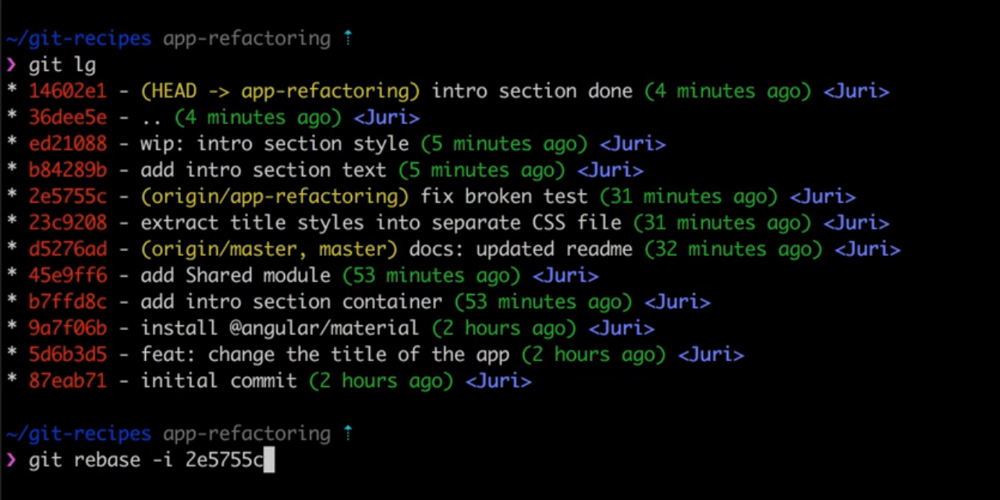
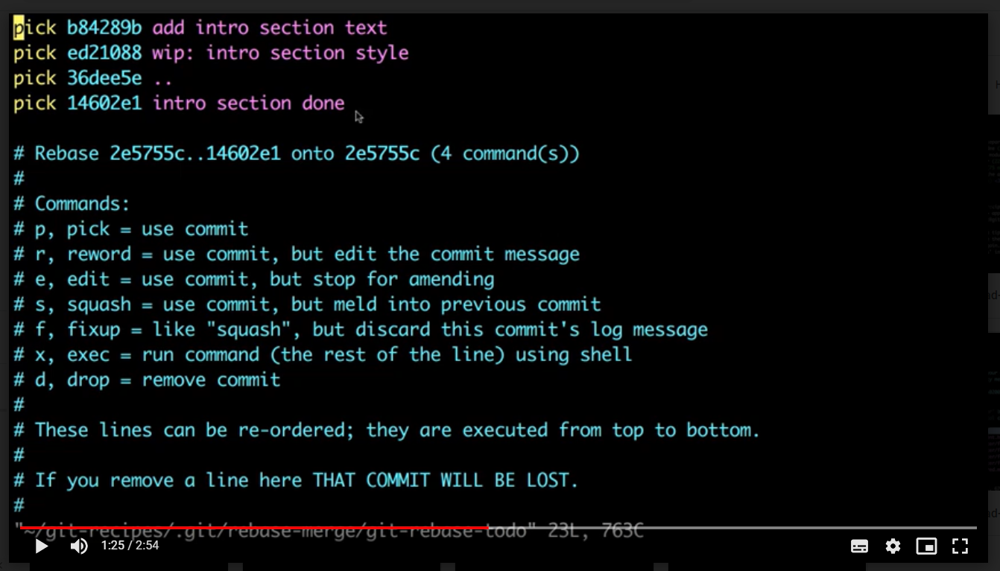
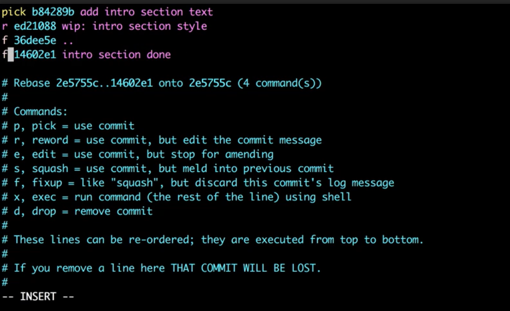

`git-log` - Show commit logs

В Git'е есть два способа включить изменения из одной ветки в другую: `merge` (слияние) и `rebase` (перемещение).

## Change commits

1.  `git log`
1.  `git rebase -i COMMIT_HASH`

    

1.  Choose commit wich you want to change.

    

1.  `:wq`
1.  Rename commit

    

1.  `:wq`

1.  `git log`
