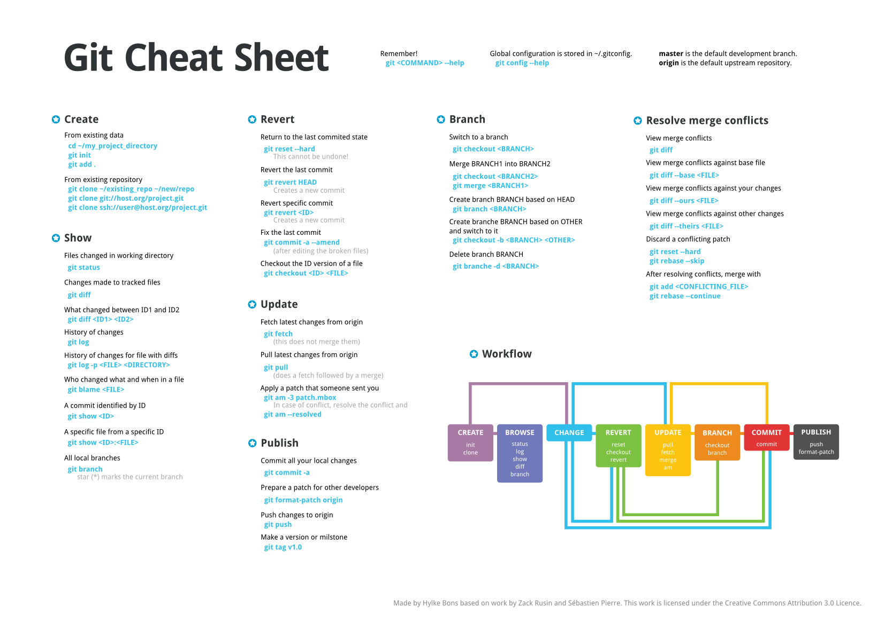

**Working** - your red files

**Staging** - Green files

**Local** - commited on local (NOT pushed)

**Remote** - committed and pushed to remote (i.e. GitHub)




- **git diff** - сховати зміни
- **git pop** - повернути сзовані зміни назад

* **git commit --amend**

#

### це ЛИШЕ коли зміни не закомічені:

- **git checkout .** - прибрати всі зміни(change commit)

```
$ git reset .
$ git checkout .
```

`reset` робить зелені файли червоними

`checkout` прибирає зміни (червоні файли)
